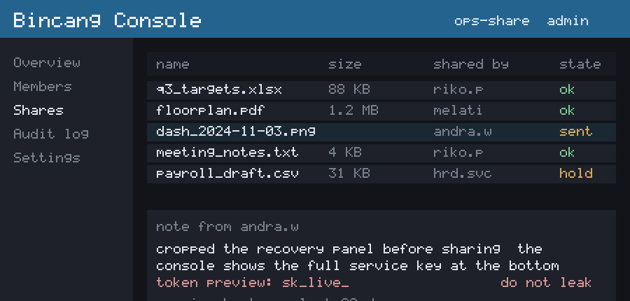
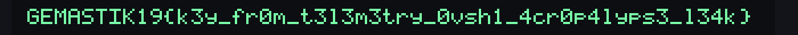
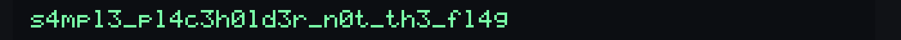

# overshare writeup (padat)

Flag: `GEMASTIK19{k3y_fr0m_t3l3m3try_0vsh1_4cr0p4lyps3_l34k}`

Handout cuma `capture.pcap`. Alurnya: triage → pulihkan kunci dari beacon telemetry
→ dekripsi frame WebSocket → reverse kontainer `OVSH1` → recovery aCropalypse → baca
token. Solver otomatis penuh ada di `../solve.py`; di bawah ini jalur manual.

Tools: `tshark`/Wireshark, `python3` (`cryptography`, `numpy`, `pillow`), `zlib`
(builtin). Opsional: `scapy`/`pyshark` (ganti tshark), `feh`/`eog`/`display`
(ImageMagick) buat lihat gambar, `binwalk`/`xxd` buat ngintip byte.

## 0. Recon

```bash
# apa saja yang ada di capture
tshark -r capture.pcap -q -z io,phs

# sekali lihat semua yang human-readable (gaya cepat)
tshark -r capture.pcap -Y 'http || dns || icmp || websocket' -T fields \
  -e frame.number -e ip.src -e ip.dst -e _ws.col.Info \
  -e http.request.uri -e dns.qry.name
```

Di Wireshark GUI: `Statistics > Protocol Hierarchy`, lalu `Follow > WebSocket Stream`.

## 1. Peta sesi

Ada dua sesi WebSocket upload biner ke `gw.bincang-app.net:8090`, dan itu yang
penting. Sisanya umpan (flag.txt palsu, DNS TXT, telemetry sampah, chat "berhenti
analisis").

```bash
# frame parameter sesi tiap upload (channel-nya kelihatan di sini)
tshark -r capture.pcap -Y 'websocket.opcode==1 and frame contains "session"' \
  -T fields -e tcp.stream -e websocket.payload | while read s p; do
    echo "stream $s: $(echo $p | xxd -r -p)"; done
```

Hasilnya dua channel: `share` dan `backup`. Sesi cuma nyebut `cipher:chacha20` dan
`framenonce:uint128_be(seq)`, TIDAK nyebut kunci. Jadi kuncinya di tempat lain.

## 2. Pulihkan kunci dari telemetry

Kunci bocor kepingan lewat beacon `GET /telemetry?ch=..&s=..&b=..`. Korelasinya
lewat `ch` yang sama dengan channel upload. Beacon telemetry tanpa `ch/s/b` itu
metrics biasa, abaikan.

```bash
tshark -r capture.pcap -Y 'http.request.uri contains "/telemetry?ch"' \
  -T fields -e http.request.uri
# /telemetry?ch=share&s=2&b=VcbgkXrUAos=  ... dst
```

Gabung per channel: urutkan pakai `s`, urlsafe-base64-decode `b`, sambung → 32 byte.

```python
import base64
frags = {}   # isi dari output tshark di atas (channel share)
for s, b in [(0,"nyx6EOS402U="),(1,"Ch-MR7IJ3jM="),(2,"VcbgkXrUAos="),(3,"bxPJXncIqkI=")]:
    frags[s] = base64.urlsafe_b64decode(b)
key = b"".join(frags[i] for i in sorted(frags))   # 32 byte
```

## 3. Ekstrak frame biner upload

`websocket.payload` sudah ter-unmask oleh tshark. Tiap frame = `seq(u32) | len(u16)
| ciphertext`. Pisahkan per `tcp.stream` (stream channel `share` dari langkah 1).

```bash
tshark -r capture.pcap -Y 'websocket.opcode==2 && tcp.stream==21' \
  -T fields -e websocket.payload > share_frames.hex
```

## 4-6. Dekripsi → reverse OVSH1 → aCropalypse

```python
import base64, struct, zlib, numpy as np
from cryptography.hazmat.primitives.ciphers import Cipher, algorithms
from PIL import Image

# `key` = 32 byte hasil langkah 2 (gabungan fragmen telemetry channel share)

# 4) ChaCha20, nonce = seq (16 byte big-endian), urut pakai seq
chunks = {}
for line in open("share_frames.hex"):
    fr = bytes.fromhex(line.strip().replace(":", ""))
    seq, ln = struct.unpack(">IH", fr[:6]); ct = fr[6:6+ln]
    chunks[seq] = Cipher(algorithms.ChaCha20(key, seq.to_bytes(16, "big")),
                         mode=None).decryptor().update(ct)
blob = b"".join(chunks[i] for i in sorted(chunks))
assert blob[:6] == b"OVSH1\x00"

# 5) reverse kontainer, header self-describing (baca layer + params dari header)
orig = struct.unpack(">I", blob[6:10])[0]; n = blob[10]; off = 11; layers = []
for _ in range(n):
    t, pl = blob[off], blob[off+1]; layers.append((t, blob[off+2:off+2+pl])); off += 2+pl
body = blob[off:off+orig]

def xorshift(seed, a, b, c, ln):
    x = seed & 0xffffffff; o = bytearray()
    for _ in range(ln):
        x ^= (x << a) & 0xffffffff; x ^= x >> b; x ^= (x << c) & 0xffffffff; o.append(x & 0xff)
    return bytes(o)

def wordswap(d):
    d = bytearray(d)
    for i in range(0, len(d)-3, 4):
        d[i], d[i+1], d[i+2], d[i+3] = d[i+2], d[i+3], d[i], d[i+1]
    return bytes(d)

for t, p in reversed(layers):                 # inverse dari belakang ke depan
    if t == 2: body = wordswap(body)
    elif t == 1:
        s, a, b, c = struct.unpack(">IBBB", p)
        body = bytes(x ^ y for x, y in zip(body, xorshift(s, a, b, c, orig)))
png = body
assert png[:8] == b"\x89PNG\r\n\x1a\n"

# 6) aCropalypse: sisa setelah IEND -> cari sync 00 00 ff ff -> raw inflate -> de-filter Sub
W = struct.unpack(">I", png[png.find(b"IHDR")+4:png.find(b"IHDR")+8])[0]
tail = png[png.find(b"IEND")+8:]; stride = 1 + W*3; best = None; i = -1
while True:
    i = tail.find(b"\x00\x00\xff\xff", i+1)
    if i < 0: break
    try: raw = zlib.decompressobj(-15).decompress(tail[i+4:])
    except Exception: continue
    nr = len(raw)//stride
    if nr and {raw[r*stride] for r in range(nr)} == {1} and (best is None or nr > best[0]):
        best = (nr, raw)
nr, raw = best
rows = np.stack([                              # de-filter Sub = cumsum per kanal
    (np.cumsum(np.frombuffer(raw[r*stride+1:r*stride+1+W*3], np.uint8).reshape(W, 3).astype(int), axis=0) % 256).astype(np.uint8)
    for r in range(nr)])
Image.fromarray(rows).save("recovered.png")
```

Kalau `png` di atas dibuka apa adanya, kelihatan cuma dashboard yang sudah dipotong
(panel token ke-crop, tidak kelihatan):



Setelah recovery aCropalypse, buka `recovered.png` (`feh recovered.png` /
`display recovered.png` / dobel klik). Panel bawah gambar asli menampilkan flag:



## Channel backup

Kalau langkah 2-6 diulang untuk channel `backup`, semuanya jalan sampai akhir dan
juga keluar token lewat aCropalypse, tapi tokennya jelas cuma sample:



Bukan format flag, dan panelnya sendiri nulis "SAMPLE / decoy", jadi channel itu
buntu. Itu sebabnya kedua channel harus diproses lalu dibandingkan.
